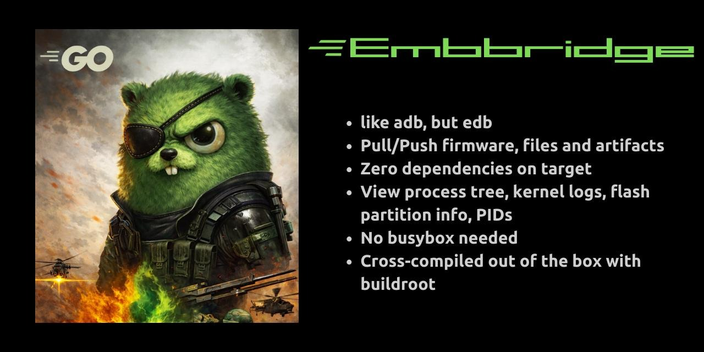

# embbridge

<p align="center">
  
</p>

<p align="center">
  
  
  
  <br>
  <a href="https://github.com/Necromancer-Labs"></a>
  <a href="https://github.com/Necromancer-Labs/gocmd2"></a>
  <a href="https://necromancer-labs.github.io/embbridge/"></a>
</p>

**Embedded Debug Bridge** — adb, but for embedded systems.

A lightweight agent/client tool for interacting with embedded devices. Useful for firmware analysis, security research, and device forensics.

## The Problem

Android has `adb`. It's standard, reliable, and works the same on every device. You can always `adb pull`, `adb shell`, `adb push`, etc.

Embedded Linux has nothing like this. Every device is different:
- Different shells (or none)
- Different available utilities (busybox, toybox, UART, telnet)
- Different file transfer options (tftp? scp? wget? none?)
- No consistent way to collect firmware, logs, or artifacts

You never know what you're going to get, this is frustrating. 

## The Solution

embbridge provides an adb-like experience for any embedded Linux system:
- **One agent binary** — statically linked, ~50-180KB, runs anywhere
- **Consistent interface** — same commands work on every device
- **Self-contained** — doesn't rely on target utilities; all commands implemented natively

## Quick Start

**1. Identify target architecture:**
```bash
# On target device
cat /proc/cpuinfo
```

**2. Get the matching binary** from [releases](https://github.com/Necromancer-Labs/embbridge/releases):

| CPU | Binary |
|-----|--------|
| ARM (v5, v6, v7) | `edb-agent-arm` |
| ARM64 / AArch64 | `edb-agent-arm64` |
| MIPS big-endian | `edb-agent-mips` |
| MIPS little-endian | `edb-agent-mipsel` |

**3. Transfer to target and run:**
```bash
# On target
chmod +x /tmp/edb-agent
/tmp/edb-agent -l 1337        # listen mode
# or
/tmp/edb-agent -c 192.168.1.100:1337  # connect back to you
```

> Need help getting the binary onto the target? See [transfer techniques](https://necromancer-labs.github.io/embbridge/quickstart.html#2-transfer-agent-to-device).

**4. Connect from workstation:**
```bash
./edb shell 192.168.1.50:1337
```

## Features

| Command | Description |
|---------|-------------|
| `ls`, `cd`, `pwd`, `cat` | Directory navigation and file viewing |
| `pull <remote> [local]` | Download file from device |
| `push <local> <remote>` | Upload file to device |
| `rm`, `mv`, `cp`, `mkdir`, `chmod` | File operations |
| `ps` | Process tree |
| `ss` | Network connections with PIDs |
| `uname`, `whoami` | System info |
| `dmesg` | Kernel log |
| `strings <file>` | Extract printable strings |
| `exec <cmd>` | Run binary (no shell) |
| `reboot` | Reboot device |

## Connection Modes

**Bind mode** — agent listens, you connect to it:
```bash
# Device
./edb-agent -l 1337

# Workstation
./edb shell 192.168.1.50:1337
```

**Reverse mode** — agent connects out to you:
```bash
# Workstation
./edb listen

# Device
./edb-agent -c 192.168.1.100:1337
```

## Building

### Client (Go)

```bash
cd client && go build -o edb .
```

### Agent (C)

```bash
cd agent
make              # Native debug build
make release      # Native release build
make arm          # Cross-compile for ARM
make mipsel       # Cross-compile for MIPS little-endian
make all-arch     # Build all architectures
```

Cross-compilation requires buildroot toolchains. Run `./scripts/build-toolchains.sh` first (one-time, ~30 min per arch).

### Supported Architectures

| Binary | Compatibility | Typical Devices |
|--------|---------------|-----------------|
| `edb-agent-arm` | ARMv5+ (v5, v6, v7, v8 32-bit) | Raspberry Pi, NVRs, IoT |
| `edb-agent-arm64` | AArch64 | Typically modern ARM systems |
| `edb-agent-mips` | MIPS32 big-endian | Broadcom routers |
| `edb-agent-mipsel` | MIPS32 little-endian | Consumer routers like tplinks or Dlinks |

All binaries are statically linked (~50-180KB) with no runtime dependencies.

## Design

- **Agent (C)**: Tiny static binary. No external dependencies. All commands implemented natively — no reliance on busybox or target shell.
- **Client (Go)**: Interactive readline shell with history.
- **Protocol**: MessagePack over TCP with length-prefixed framing.

## Future Features

- **Relative paths** — support `./` and `../` in common commands
- **`ip` command** — show interfaces (`ip a`) and routes (`ip r`)
- **Interactive exec** — PTY support for interactive sessions

## License

MIT

---

*Necromancer Labs*