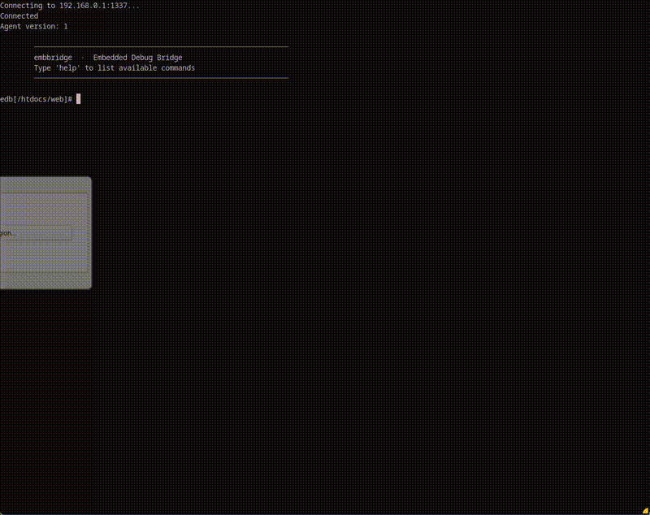

# embbridge

<p align="center">
  
</p>

<p align="center">
  
  
  
  <br>
  <a href="https://github.com/Necromancer-Labs"></a>
  <a href="https://github.com/Necromancer-Labs/gocmd2"></a>
  <a href="https://github.com/charmbracelet/bubbletea"></a>
  <a href="https://github.com/charmbracelet/lipgloss"></a>
  <a href="https://necromancer-labs.github.io/embbridge/"></a>
</p>

<p align="center">
  <em>Demo:</em> D-Link DIR-645 (MIPS32 Little-Endian aka mipsel)<br>
  <em>Technique: <a href="https://github.com/fxc233/iot-vul/tree/main/D-Link/DIR-645">RCE PoC</a> + telnet & + wget -o /tmp/agent <ip:port>/edb-agent-mipsel</em><br>
  <em>Purpose:</em> edb pull root filesystem (rootfs in the /dev/mtd1) for local analysis<br><br>
  
</p>

**Embedded Debug Bridge - embbridge** — like adb, but edb

`edb` is a protocol and lightweight agent/client tool for interacting with embedded devices. Useful for firmware analysis, security research, device forensics, kernel debugging, and more.

## The Goal:

Android has `adb`. You can `adb pull`, `adb push`, `adb shell`, etc. It's standard, reliable, and works the same on every device.

Embedded systems now have `edb`. You can `edb pull`, `edb push`, `edb shell`, etc. Cross-compiled with [buildroot](https://github.com/buildroot/buildroot) to several architectures, it is also standard, reliable, and (*should*) works the same on every (*most*) devices. 

## TUI Libraries
The TUI uses a hybrid architecture — see [tui/README.md](tui/README.md) for details.

<p align="center">
  <a href="https://github.com/charmbracelet/bubbletea"></a>
  <a href="https://github.com/charmbracelet/lipgloss"></a>
  <a href="https://github.com/Necromancer-Labs/gocmd2"></a>
</p>

## Quick Start

**1. Identify correct target architecture:**
> Need help finding target architecture? See [architecture-reference](https://necromancer-labs.github.io/embbridge/quickstart.html#3-architecture-reference).
```bash
# On target device
cat /proc/cpuinfo
```

**2. Get the matching binary** from [releases](https://github.com/Necromancer-Labs/embbridge/releases):

| CPU | Binary |
|-----|--------|
| ARMv5+ (v5, v6, v7) | `edb-agent-arm` |
| ARM64 / AArch64 | `edb-agent-arm64` |
| MIPS32 big-endian | `edb-agent-mips` |
| MIPS32 little-endian | `edb-agent-mipsel` |

**3. Transfer to target and run:**
> Need help getting the binary onto the target? See [transfer techniques](https://necromancer-labs.github.io/embbridge/quickstart.html#2-transfer-agent-to-device).

```bash
# On target
chmod +x /tmp/edb-agent
/tmp/edb-agent -l 1337                # bind (listen and wait)
# or
/tmp/edb-agent -c 192.168.1.100:1337  # reverse (connect to your client)
```

**4. Connect from workstation:**
```bash
./edb shell 192.168.1.50:1337
```

## Features

| Command | Description |
|---------|-------------|
| `ls`, `cd`, `pwd`, `cat` | Directory navigation and file viewing |
| `pull <remote> [local]` | Download file from device |
| `push <local> <remote>` | Upload file to device |
| `rm`, `mv`, `cp`, `mkdir`, `chmod` | File operations |
| `ps` | Process tree |
| `ss` | Network connections with PIDs |
| `ip`, `ip-route` | Network interfaces and routing table |
| `uname`, `whoami` | System info |
| `dmesg` | Kernel log |
| `strings <file>` | Extract printable strings |
| `exec <cmd>` | Run binary (no shell) |
| `reboot` | Reboot device |

## Connection Modes

### Single Device (1-to-1)

Use the `edb` client for quick, direct connections:

**Bind mode** — agent listens, you connect to it:
```bash
# Device
./edb-agent -l 1337

# Workstation
./edb shell 192.168.1.50:1337
```

**Reverse mode** — agent connects out to you:
```bash
# Workstation
./edb listen

# Device
./edb-agent -c 192.168.1.100:1337
```

### Multiple Devices (1-to-Many) — Graveyard TUI

For managing multiple devices, use **Graveyard** — a full-featured TUI that tracks all your agents:

```bash
# Start the graveyard dashboard
cd tui && ./graveyard

# Agents connect in bind mode
./edb-agent -l 1337
```

Graveyard features:
- **Visual dashboard** — see all connected devices at a glance
- **Persistent memory** — devices are saved to `~/.graveyard_devices.yaml`
- **Reconnection** — previously-seen devices appear on restart, ready to reconnect
- **Device customization** — custom names, colors, and architecture labels
- **Status tracking** — live status badges (LIVE, DEAD, BUSY, XFER)

## Building from source

### Client (Go)

```bash
cd client && go build -o edb .
```

### Agent (C) - Using Buildroot's toolchains

```bash
cd agent
make              # Native debug build
make release      # Native release build
make arm          # Cross-compile for ARM
make mipsel       # Cross-compile for MIPS little-endian
make all-arch     # Build all architectures
```

Cross-compilation requires buildroot toolchains. Run `./scripts/build-toolchains.sh` first (one-time, ~30 min per arch).

### Supported Architectures

| Binary | Compatibility | Typical Devices |
|--------|---------------|-----------------|
| `edb-agent-arm` | ARMv5+ (v5, v6, v7, v8 32-bit) | Raspberry Pi, NVRs, IoT |
| `edb-agent-arm64` | AArch64 | Typically modern ARM systems |
| `edb-agent-mips` | MIPS32 big-endian | Broadcom routers |
| `edb-agent-mipsel` | MIPS32 little-endian | Consumer routers like tplinks or Dlinks |

All binaries are statically linked (~50-180KB) with no runtime dependencies.

## Design

- **Agent (C)**: Tiny static binary. No external dependencies. All commands implemented natively — no reliance on busybox or target shell.
- **Client (Go)**: Interactive readline shell with history.
- **Protocol**: MessagePack over TCP with length-prefixed framing.

## Future Features

- **Relative paths** — support `./` and `../` in common commands
- **Interactive exec** — PTY support for interactive sessions

## License

MIT

---

*Necromancer Labs*